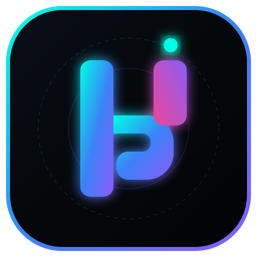

<div align="center">
  
  <h1>Hookpost</h1>
  <p><strong>The All-in-One Open-Source Social Media Scheduler & Multi-Agent AI Copilot</strong></p>
  <p><em>Postiz & Buffer alternative built for creators, developers, and automation teams.</em></p>

  <p>
    <a href="https://hookpost.hookstep.in"></a>
    <a href="https://opensource.org/license/agpl-v3"></a>
    <a href="https://hub.docker.com"></a>
    <a href="https://nextjs.org"></a>
  </p>

  <p>
    <a href="https://hookpost.hookstep.in/auth"><strong>Get Started for Free (Cloud) »</strong></a> •
    <a href="#-quick-start-self-hosted"><strong>Self-Host with Docker »</strong></a> •
    <a href="https://hookpost.hookstep.in/alternatives/postiz"><strong>Documentation »</strong></a>
  </p>
</div>

---

## ⚡ What is Hookpost?

**Hookpost** is a modern, open-source social media management and scheduling platform. Write your post once and publish across **30+ social networks** simultaneously, or prompt your favorite AI agent (Claude, ChatGPT, OpenClaw, Hermes) to draft, generate visuals, and schedule posts for you via our CLI and Model Context Protocol (MCP) server.

### 🌟 Key Features

* 🤖 **Multi-Agent AI Copilot**: Drive scheduling directly through Claude, ChatGPT, Codex, or OpenClaw via our Model Context Protocol (MCP) server and CLI (`npx hookpost`).
* 🌐 **30+ Social Networks**: Publish to X (Twitter), LinkedIn, Instagram, Facebook, Threads, YouTube, TikTok, Reddit, Pinterest, Bluesky, Mastodon, Telegram, Discord, Slack, and more.
* 📅 **Visual Calendar & Grid Scheduler**: Drag-and-drop planning with per-platform character limits and post previews.
* 🎨 **Built-In AI Media Suite**: Generate platform-tailored hooks, high-res AI images, and short video clips inside the composer.
* 🔄 **Automation & API**: Native REST API, Webhooks, and plug-and-play integrations with **n8n** and **Make.com**.
* 💳 **Transparent Pricing & Razorpay Billing**: Localized currency support (INR / USD), instant UPI, Cards, and NetBanking checkout.
* 🛡️ **100% Open-Source & Self-Hostable**: Own your data, run with Docker Compose on any VPS.

---

## 🚀 Quick Start (Self-Hosted)

Run Hookpost on your local machine or VPS in under 60 seconds with Docker Compose:

```bash
# 1. Clone the repository
git clone https://github.com/jatinder14/hookpost.git
cd hookpost

# 2. Copy the environment template
cp .env.example .env

# 3. Start the stack
docker compose -f docker-compose.dev.yaml up -d
```

Once started, open your browser and navigate to:
* **Frontend UI**: [http://localhost:4007](http://localhost:4007)
* **Backend API**: [http://localhost:3000](http://localhost:3000)

---

## ☁️ Hookpost Cloud (Managed SaaS)

Don't want to manage Docker, Redis, PostgreSQL, and OAuth app verification yourself?

👉 **[Try Hookpost Cloud with a 7-Day Free Trial](https://hookpost.hookstep.in/auth)**

* Zero setup fees & automated backups.
* 99.9% high-availability uptime.
* Seamless payments with Razorpay (UPI, Credit/Debit Cards, NetBanking).

---

## 🛠️ Architecture & Tech Stack

* **Frontend**: Next.js 16 (App Router), React 19, Tailwind CSS, TurboPack
* **Backend**: NestJS, TypeScript, Prisma ORM
* **Database**: PostgreSQL (Neon-ready)
* **Cache / Queue**: Redis (Upstash / Local Redis BullMQ)
* **AI Engine**: Model Context Protocol (MCP), OpenClaw, OpenAI / Anthropic SDKs

---

## 📜 Attribution & License

**Hookpost is a modified derivative of [Postiz](https://github.com/gitroomhq/postiz-app)**, originally developed by Gitroom Inc. and licensed under **AGPL-3.0**.

Hookpost is not affiliated with, endorsed by, or sponsored by Postiz or Gitroom Inc. "Postiz" and "Gitroom" are their respective trademarks. See [`NOTICE`](./NOTICE) for the detailed attribution and modified components.

Under AGPL-3.0 Section 13, the complete source code for Hookpost is publicly maintained and free for everyone to use and inspect.

---

<div align="center">
  <p>Built with ❤️ by the HookStep Team • <a href="https://hookpost.hookstep.in">hookpost.hookstep.in</a></p>
</div>
